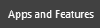
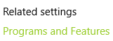

# COVID_19_Canada

A repository for COVID-19 Canada Ansible playbooks using the Covid19tracker.ca API
John Capobianco July 17,2020

## Instructions for Linux users

### Linux prequisites

These playbooks have been developed and tested under Ansble 2.9.1 on CentOS 7.8.2003

You will require Git, Ansible, Node.js 12, and Mark Map

#### Install steps - CentOS

1. Update yum

$ sudo yum -y update

2. Install Ansible

$ sudo yum install epel-release
$ sudo yum install ansible

3. Install node.js 12

$ curl -sL https://rpm.nodesource.com/setup_12.x | sudo bash -
$ sudo yum install -y gcc-c++ make
$ sudo yum install -y nodejs

4. Install Mark Map

$ npm install markmap-lib -g

#### Install steps - Ubuntu

1. Update Ubuntu - this step will take some time. 

$ sudo apt update
$ sudo apt-get upgrade -y

2. Make sure Python is installed.

$ sudo apt-get install python -y

3. Install Ansible.

$ sudo apt-add-repository ppa:ansible/ansible
$ sudo apt-get update
$ sudo apt-get install ansible -y

4. Install node.js

$ sudo apt install npm

5. Install Mark Map 

$ npm install markmap-lib -g

## Instructions for Windows Users

### Windows Prequisites

These playbooks require the Windows Subsystems for Linux and the Ubuntu OS from the Microsoft Store.
Aside from this requirement, the Linux prequisites similarly apply to Windows 10.

#### Install Steps - Windows 10

1. Right-click the Windows Start icon - select Apps and Features.

2. In the Apps and Features window - click Programs and Features under Related Settings on the right side of Apps and Features.

3. Click Turn Windows Features On or Off in the left (with the shield icon) side of the Programs and Features window.

4. Scroll to bottom of the Features window and put a check mark beside Windows Subsytem for Linux; Click Ok and close the open windows.

5. Launch the Microsoft Store.

6. Search for Ubuntu - click the first result.

7. Click Install.

8. Wait for Ubuntu to install.

9. Press Windows Key and start typing Ubuntu - click and launch Ubuntu.

10. The first time Ubuntu launches it has to setup - give this some time.

11. Enter your username and password for Ubuntu.

12. Update Ubuntu - this step will take some time. 

$ sudo apt update
$ sudo apt-get upgrade -y

13. Make sure Python is installed.

$ sudo apt-get install python -y

14. Install Ansible.

$ sudo apt-add-repository ppa:ansible/ansible
$ sudo apt-get update
$ sudo apt-get install ansible -y

15. Install node.js.

$ sudo apt install npm

16. Install Mark Map.

$ sudo npm install markmap-lib -g

## Clone the repository

1. git clone https://github.com/automateyournetwork/COVID_19_Canada.git

2. Modify the permissions 

chmod -R 755 /home/"username"/COVID_19_Canada

## Run the playbook(s)

cd COVID_19_Canada/playbooks

### All Playbooks

ansible-playbook all.yml

### Select Playbooks

ansible-playbook cases.yml

ansible-playbook fatalities.yml

ansible-playbook global_summary.yml

ansible-playbook provinces.yml

ansible-playbook report.yml

ansible-playbook summary.yml

## Review the reports

The Reports are stored in COVID_19_Canada/reports.

/csv

Contains comma separated format.

/markdown

Contains mark down format.

/mindmaps

Contains HTML mind maps best viewed in Google Chrome